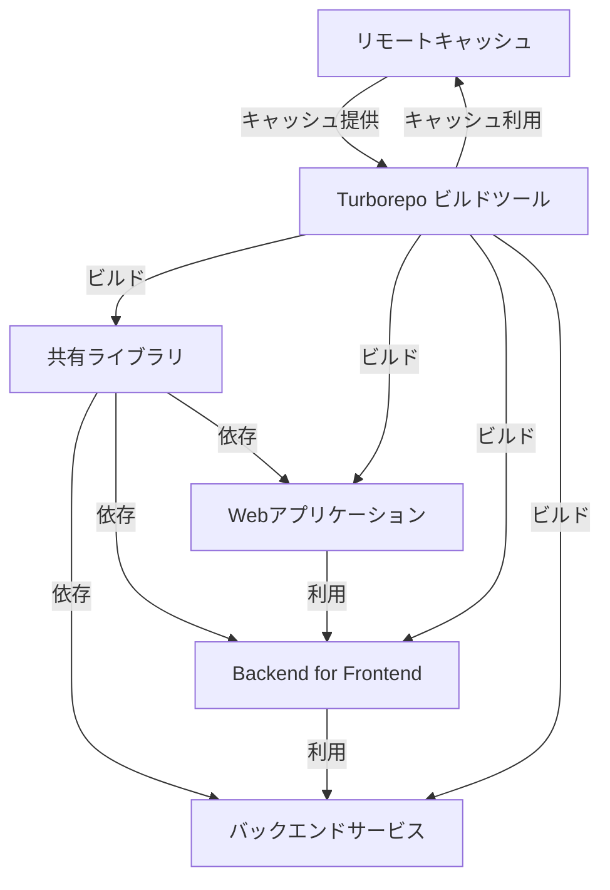

# monorepo_service_guide: frontend
モダンなサービス開発のガイドリポジトリ: フロントエンド

### 特徴

Turborepoによって管理されています。Turborepoは、JavaScriptおよびTypeScriptのための超高速なモノレポビルドシステムです。これにより、複数のパッケージやアプリケーションを一つのリポジトリで効率的に管理することができます。

- 高速なビルド: Turborepoはキャッシングと並列処理により、ビルド時間を大幅に短縮します。
- モジュラー設計: 各パッケージやアプリケーションは独立しているため、開発が容易で、再利用性が高まります。
- 一元管理: 全ての依存関係、ツール、スクリプトを一つのリポジトリで管理することで、整合性とメンテナンスの効率が向上します。
- スケーラビリティ: 大規模なプロジェクトでもスムーズに管理できる構造を提供します。



### 利用方法

プロジェクトのクローン、依存関係のインストール、各種コマンドの実行方法について説明します。

### クローン

```bash
git clone [リポジトリURL]
cd [プロジェクト名]
```

### 依存関係のインストール

プロジェクトルートで以下のコマンドを実行します：

```bash
pnpm install

```

### コマンドの実行

Turborepoの強力なビルドと開発スクリプトを実行するには、以下のようにします：

```bash
pnpm run build
```
